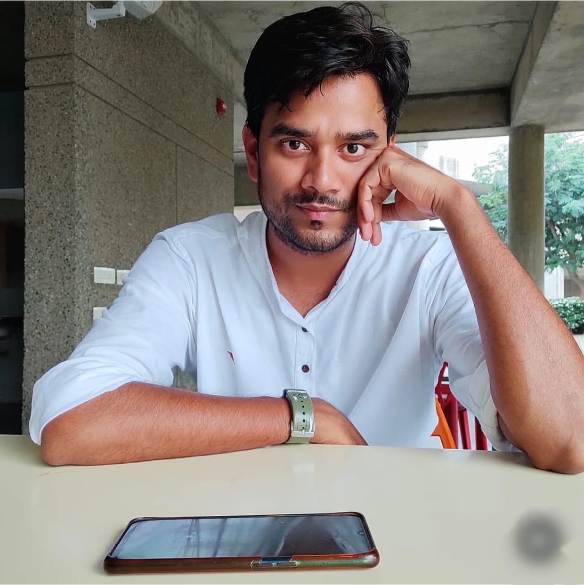

::: {.grid .gap-4}

::: {.g-col-12}
# Hello! I’m **Akbar** 
   

   
   

:::

::: {.g-col-12}

I am a third-year PhD student at the prestigious [Indian Institute of Technology Gandhinagar (IITGN)](https://iitgn.ac.in), where I delve into the world of **Computer Vision**, **Deep Generative Models**, and **Hyperspectral Imaging** within the Department of Computer Science & Engineering.

My journey so far has been a blend of academic rigor and hands-on research. Before embarking on my doctoral research, I completed both my B.Tech and M.Tech at [Aliah University](https://aliah.ac.in) and worked as a Project Associate at [IIT Ropar](https://iitrpr.ac.in), contributing to projects that intersect technology, creativity, and real-world impact.

**My Research Focus:**
- Developing cutting-edge techniques in **computer vision** to bridge the gap between visual understanding and machine intelligence.
- Exploring the potential of **deep generative models** to revolutionize the way we generate and interpret visual data.
- Applying **hyperspectral imaging** to gain deeper insights into visual data, enabling new ways to analyze complex environments.

> I enjoy tackling hard problems, building reproducible research code, and publishing robust models. I’m driven by curiosity and care about clean, well-documented work.
:::

:::

---

## 🎓 Education

**Indian Institute of Technology Gandhinagar**, Gujarat, India  
*Ph.D., Computer Science & Engineering*  
📅 **Dec 2022 – Present** · **CPI:** 9.14 / 10

---

**Aliah University**, West Bengal, India  
*M.Tech, Computer Science & Engineering*  
📅 **Jun 2019 – Jul 2021** · **CPI:** 9.03 / 10

---

**Aliah University**, West Bengal, India  
*B.Tech, Computer Science & Engineering*  
📅 **Jun 2015 – Jul 2019** · **CPI:** 8.97 / 10

## Academic milestones

- **UGC NET** — Qualified (2022)  
- **2nd Rank** — Overall in M.Tech program *(University Topper, 2021)* 
- **1st Rank** — AUAT M.Tech Entrance (2019) 
- **1st Rank** — Overall in B.Tech program *(University Topper, 2019)* 
- **64th Rank** — AUAT B.Tech Entrance (2015) 
- **National Scholarship** — awarded 3× (B.Tech) & 2× (M.Tech)  
- **Other Exams** — BCECE, WB JEE & AIEEE qualified; 1st Prize in Chemistry (2012)

---

## Skills & Tools

**Programming Languages**  
🟢 Python  
🔵 C / C++

**Frameworks & Libraries**  
🟣 PyTorch   
🟤 scikit-learn

**Tools & Platforms**   
💻 Git  
📄 LaTeX  

**Research Areas**  
Computer Vision · Generative Models · Hyperspectral Imaging · Image Restoration 

---

## UAV Pilot License & Experience

**UAV Pilot License** — Certified to fly up to **25 kg**  
Experienced with **DJI Mavic** and **Bajrang** drones.  
Operational tasks include **data collection**, **aerial inspection**, and **spectral imaging**.

**Safety & Compliance**  
- Pre-flight checks  
- Flight mission planning  
- Data transfer and storage procedures

---

## 

::: callout 
· **Google Scholar:** [profile](https://scholar.google.com/citations?user=g-2Aix8AAAAJ&hl=en)
· **X/Twitter:** [akbarali](https://x.com/AamaanAkbar)
:::

---