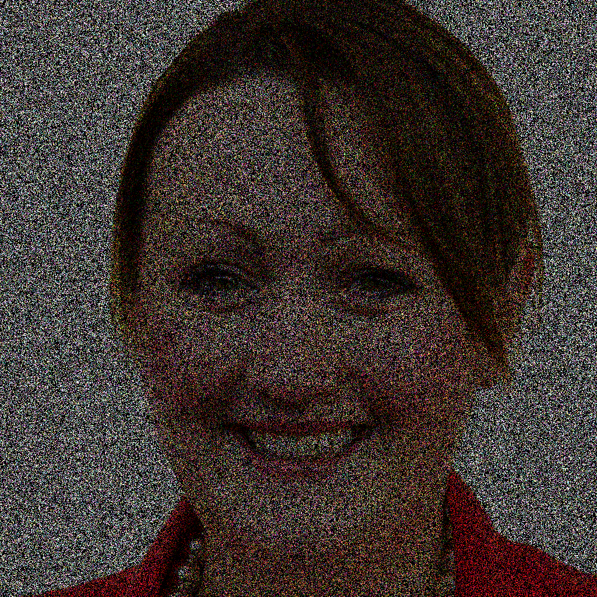
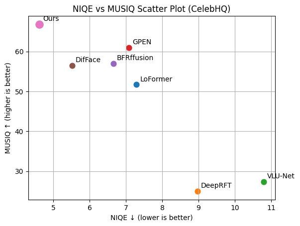
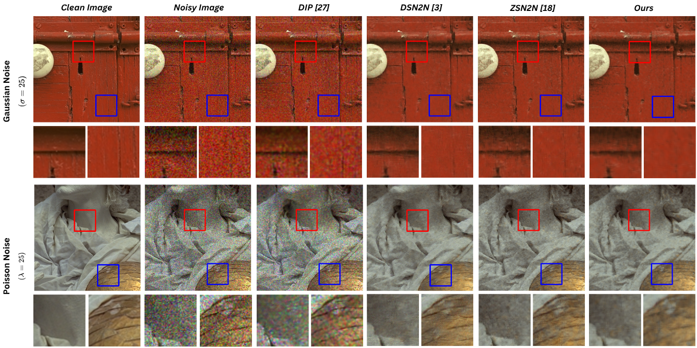
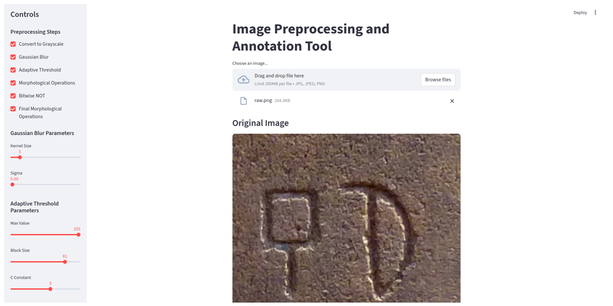
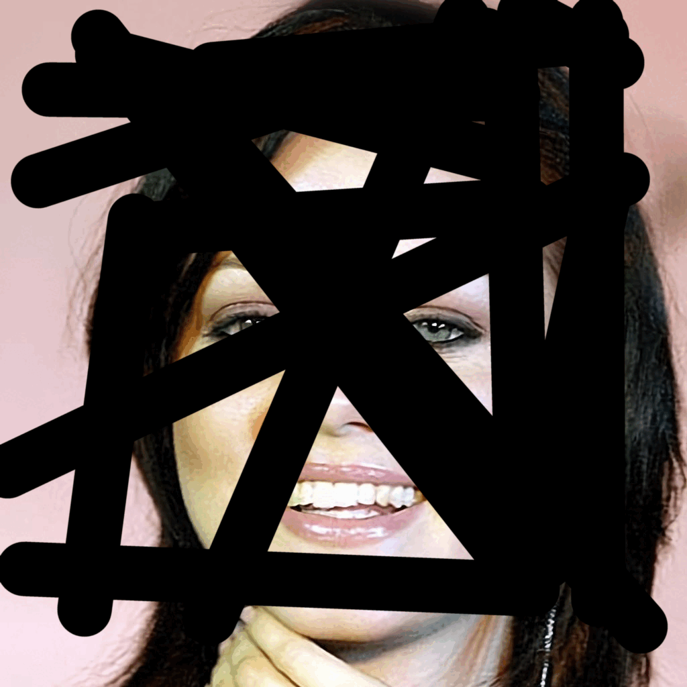
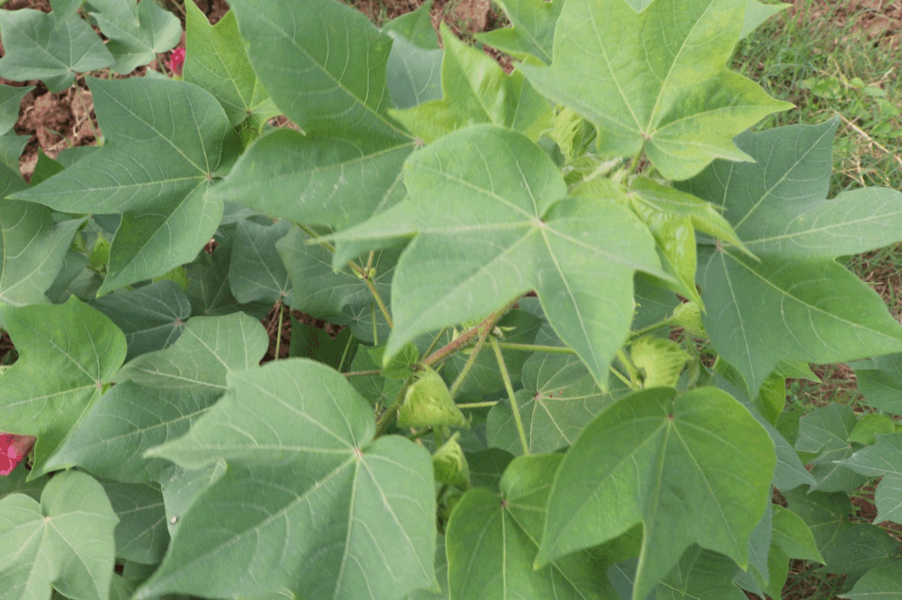
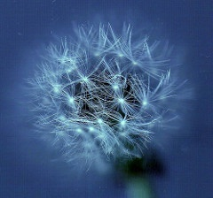

##    2026

::: {.grid .gap-4}

::: {.g-col-2}
{.img-fluid .rounded .shadow style="width:100%;border-radius:10px;"}
:::

::: {.g-col-10}
[GenR: Robust Generative Face Image Restoration in Latent Space](https://ieeexplore.ieee.org/abstract/document/11084742)  
*Akbar Ali, Indra Deep Mastan, and Shanmuganathan Raman*  
*(Published by, [PRL 2026](https://www.sciencedirect.com/journal/pattern-recognition-letters))* — Apr 2026  

[PDF](https://doi.org/10.1016/j.patrec.2026.04.021) · [Code](https://github.com/aamaanakbar/GenR) 
:::

:::

---

::: {.grid .gap-4}

::: {.g-col-2}
{.img-fluid .rounded .shadow style="width:100%;border-radius:10px;"}
:::

::: {.g-col-10}
[Unsupervised Image Deblurring in latent space using Pivotal Tuning Inversion](https://ieeexplore.ieee.org/abstract/document/11084742)  
*Akbar Ali, Indra Deep Mastan, and Shanmuganathan Raman*  
*(Manuscript under review, [IEEE SPL 2026](https://cvpr.thecvf.com/))* — Feb 2026  

[PDF] · [Project Page]
:::

:::

---

::: {.grid .gap-4}

::: {.g-col-2}
{.img-fluid .rounded .shadow style="width:100%;border-radius:10px;"}
:::

::: {.g-col-10}
[ZS-CLIP2Clean: Zero-Shot CLIP-Guided Training-Free Single-Image Denoising](https://ieeexplore.ieee.org/abstract/document/11084742)  
*Abhiyodaya Pandey, Akbar Ali, Indra Deep Mastan, and Shanmuganathan Raman*  
*(Manuscript under review, [IEEE SPL 2026](https://cvpr.thecvf.com/))* — Feb 2026  

[PDF] · [Project Page]
:::

:::

---

::: {.grid .gap-4}

::: {.g-col-2}
{.img-fluid .rounded .shadow style="width:100%;border-radius:10px;"}
:::

::: {.g-col-10}
[InscriptionOCR: A Dataset and Method for Understanding Inscriptions](https://ieeexplore.ieee.org/abstract/document/11084742)  
*Jaidev Sanjay Khalane, Akbar Ali, V.N. Prabhakar, and Shanmuganathan Raman*  
*(Manuscript under review, [ICIP 2026](https://cvpr.thecvf.com/))* — Feb 2026  

[PDF] · [Project Page]
:::

:::

## 🧠 2025

::: {.grid .gap-4}

::: {.g-col-2}
{.img-fluid .rounded .shadow}
:::

::: {.g-col-10}
[Investigating Robustness of Unsupervised StyleGAN Image Restoration](https://ieeexplore.ieee.org/abstract/document/11084742)   
*Akbar Ali, Indra Deep Mastan, and Shanmuganathan Raman*  
*(Published by [ICIP 2025](https://2025.ieeeicip.org/))*  

[PDF](https://ieeexplore.ieee.org/stamp/stamp.jsp?tp=&arnumber=11084742) · [Project Page](https://aamaanakbar.github.io/investigating_rusir/) · [Dataset](https://www.kaggle.com/datasets/aamaanakbar/cotton99-10)
:::

:::

---

::: {.grid .gap-4}

::: {.g-col-2}
{.img-fluid .rounded .shadow}
:::

::: {.g-col-10}
[COT-AD: Cotton Analysis Dataset](https://ieeexplore.ieee.org/abstract/document/11084734)   
*Akbar Ali, Pankaj Khanna, Subramanian Sankaranarayanan, and Shanmuganathan Raman*  
*(Published by [ICIP 2025](https://2025.ieeeicip.org/))*  

[PDF](https://ieeexplore.ieee.org/stamp/stamp.jsp?tp=&arnumber=11084734) · [Dataset](https://www.kaggle.com/datasets/aamaanakbar/cot-ad1) · [Project Page](https://aamaanakbar.github.io/COT-AD/)
:::

:::

---

## 📘 2023

::: {.grid .gap-4}

::: {.g-col-2}
{.img-fluid .rounded .shadow}
:::

::: {.g-col-10}
[Descriptive Predictive Model for Parkinson’s Disease Analysis](https://link.springer.com/chapter/10.1007/978-981-19-7346-8_10)     
*Akbar Ali, Ranjit Kumar Rout, and Saiyed Umer*  
*(Published by Springer Nature)* — February 2023  

[PDF](https://link.springer.com/chapter/10.1007/978-981-19-7346-8_10) . [Project Page](https://link.springer.com/chapter/10.1007/978-981-19-7346-8_10)
:::

:::
