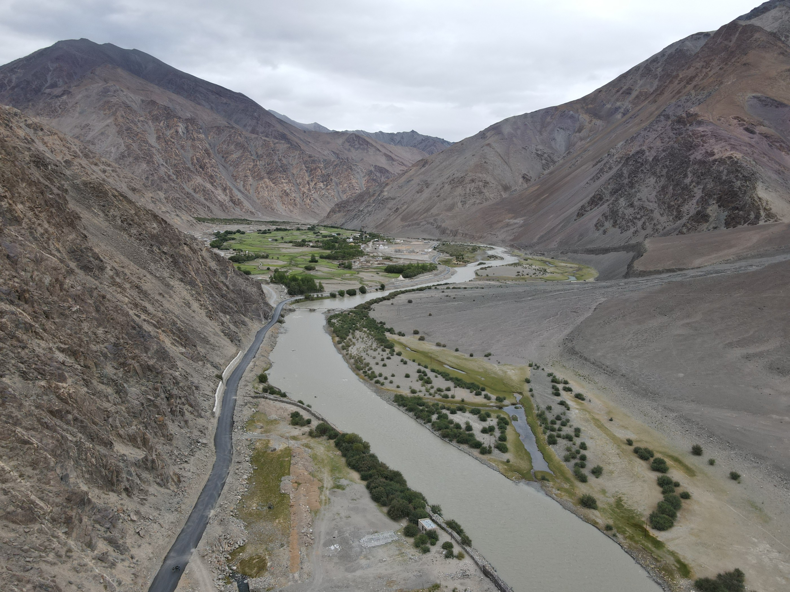

## Projects

1. **M.Tech 2021**  
   **Topic:** Prediction Model for Parkinson's Disease  
   **Advisor:** Dr. Saiyed Umer, Assistant Professor, Dept. of CSE, Aliah University, Kolkata 700156.

2. **B.Tech 2019**  
   **Topic:** Design of Home Automation using IoT  
   **Advisor:** Dr. Zeenat Rehena, Assistant Professor, Dept. of CSE, Aliah University, Kolkata 700156.

---

## Workshops

1. **3D Vision Summer School**, [IIIT Bangalore](https://www.iiitb.ac.in/), India — *June 22–28, 2024 (In-Person)*  
   Gained exposure to Deep Learning applications in 3D Vision through lectures, hands-on sessions, and research discussions led by experts.

2. **Visvesvaraya Workshop**, IIT Mandi — *May 2024*  
   Focused on advanced presentations and interdisciplinary research under the [Visvesvaraya PhD Scheme](https://phd.dic.gov.in/about).

3. **National Seminar:** *Preparation & Publication of Research Articles*, Aliah University — *March 18, 2019.*

4. **National Seminar:** *Mathematical Modelling & its Application in Natural and Engineering Science (NSMMANES-2019)*, Aliah University — *March 25, 2019.*

---

## Experimental Work

1. **3D Geophysical Image Translation using GANs**  
   *Feb 2024 – Jan 2025*  
   - Translated 3D geophysical images into photorealistic virtual outcrop geology using [GANs](https://en.wikipedia.org/wiki/Generative_adversarial_network).  
   - Developed a methodology for generating diverse geological outcrop images at varying altitudes.

2. **Smart Farming of Cotton using Aerial Imagery & Computer Vision**  
   *Jun 2023 – Jan 2024*  
   - Studied the effect of weather and pests on crop health using aerial imaging.  
   - Conducted weekly drone missions (10m, 15m, 115m altitudes) from July–December 2023, covering the full cotton growth cycle.

---

## Field Visits

::: {.grid .gap-4}

::: {.g-col-6}
### 🪨 Drone Data Acquisition  
**Department:** [Earth Science](https://es.iitgn.ac.in/)  
**Note-Due to privacy or sensitivity reasons can not write the field name**

- **Field Visit 1** — May 2023  
- **Field Visit 2** — Aug 2024  
- **Field Visit 3** — Nov 2024 

### somewhere on the earth 
   

   
   

:::

::: {.g-col-6}
### 🏙 Transport Evaluation  
**Department:** [Computer Science](https://cs.iitgn.ac.in/)  

- **Silvassa** — Jul 2024  
- **Aurangabad** — Jul 2024  
:::

:::
