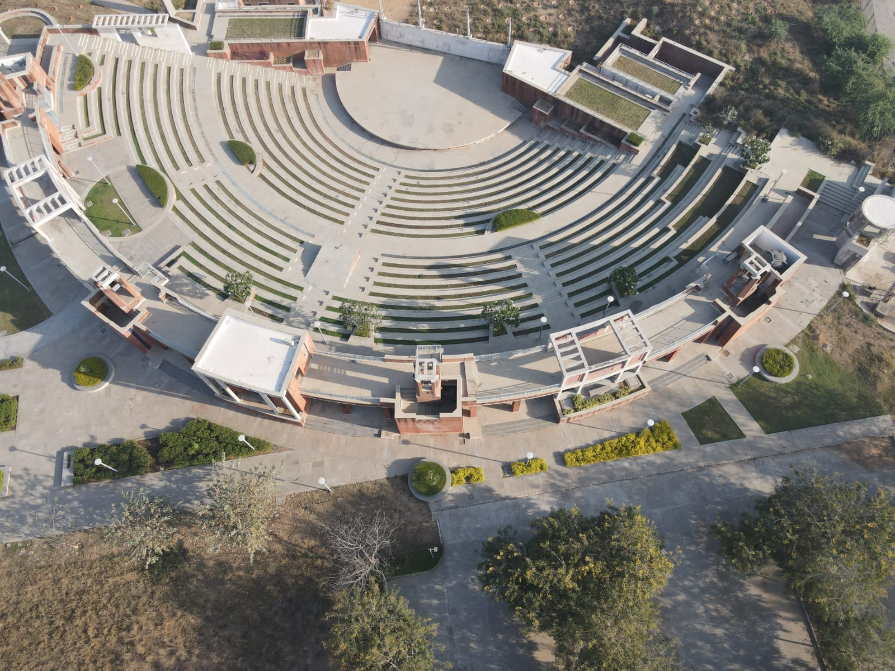

---

1. **Lead Teaching Assistant, IIT Gandhinagar** *(Jan 2025 – Apr 2025)*  
   - *Course: ES 113 – Data Centric Computing*  
   - Mentored 45 students in topics including data structures, algorithms, data analysis with Python (Pandas, Matplotlib), SQL, and basic machine learning.  
   - Supported QA sessions, graded assignments, and collaborated with faculty for smooth course delivery.

---

2. **Graduate Teaching Fellow, IIT Gandhinagar** *(Aug 2024 – Nov 2024)*  
   - *Course: FP 602 – Writing*  
   - Mentored 35 students, managing classwork, exams, and academic progress. Ensured effective communication and timely coordination of assignments.

---

3. **Teaching Assistant, IIT Gandhinagar** *(Dec 2022 – Apr 2024)*  
   - *Course: ES 114 Probability, Statistics and Data Visualization*
   - *Courses: Probability, Statistics, and Data Visualization; Probability and Randomization*  
   - Conducted lab/tutorial sessions for 50+ students using Python data science libraries. Managed evaluations and provided academic support.

---

4. **Teaching Assistant, IIT Gandhinagar** *(June 2024 – June 2024)*  
   - *Course: SC 333 – Drone Data Acquisition, Processing, and Interpretation*  
   - Assisted in conducting a short course for ~30 students on drone technology, including flight training, data acquisition, and processing techniques using RGB and multispectral imagery.  
   - Supported hands-on sessions and fieldwork to help students gain practical experience in drone operations and data interpretation.

   ### Drone Image [Rangmanch, IITGN]
   

   
   

   
